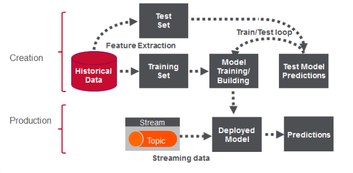

# REAL-TIME-UBER-DATA-ANALYSIS-USING-APACHE-SPARK-AND-KAFKA
Part-1 
Uber is using big data to perfect its processes, from calculating Uber’s pricing, to finding the optimal positioning of cars to maximize profits. we are going to use public Uber trip data to discuss building a real-time example for analysis and monitoring of car GPS data. There are typically two phases in machine learning with real-time data

1) Data Discovery: The first phase involves analysis on historical data to build the machine learning model.

2) Analytics Using the Model: The second phase uses the model in production on live events. (Note that Spark does provide some streaming machine learning algorithms, but you still often need to do an analysis of historical data.)

Clustering

Google News uses a technique called clustering to group news articles into different categories, based on title and content. Clustering algorithms discover groupings that occur in collections of data
