# REAL-TIME-UBER-DATA-ANALYSIS-USING-APACHE-SPARK-AND-KAFKA
Part-1 
Uber is using big data to perfect its processes, from calculating Uber’s pricing, to finding the optimal positioning of cars to maximize profits. we are going to use public Uber trip data to discuss building a real-time example for analysis and monitoring of car GPS data. There are typically two phases in machine learning with real-time data

1) Data Discovery: The first phase involves analysis on historical data to build the machine learning model.

2) Analytics Using the Model: The second phase uses the model in production on live events. (Note that Spark does provide some streaming machine learning algorithms, but you still often need to do an analysis of historical data.)

Clustering

Google News uses a technique called clustering to group news articles into different categories, based on title and content. Clustering algorithms discover groupings that occur in collections of data

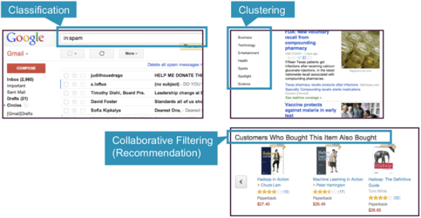

In clustering, an algorithm groups objects into categories by analyzing similarities between input examples. Examples of clustering uses include:

Search results grouping
Grouping of customers
Anomaly detection
Text categorization

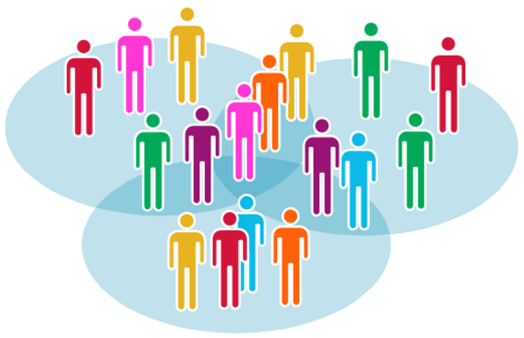

Clustering uses unsupervised algorithms, which do not have the outputs (labeled data) in advance

K-means is one of the most commonly used clustering algorithms that clusters the data points into a predefined number of clusters (k). Clustering using the K-means algorithm begins by initializing all the coordinates to k number of centroids. With every pass of the algorithm, each point is assigned to its nearest centroid based on some distance metric, which is usually Euclidean distance. The centroids are then updated to be the “centers” of all the points assigned to it in that pass. This repeats until there is a minimum change in the centers

The Data Set Schema
  Date/Time: The date and time of the Uber pickup
  Lat: The latitude of the Uber pickup
  Lon: The longitude of the Uber pickup
  Base: The TLC base company affiliated with the Uber pickup

The Data Records are in CSV format. An example line is shown below:

2014-08-01 00:00:00,40.729,-73.9422,B02598

Example Use Case Code
First, we import the packages needed for Spark ML K-means and SQL.

import org.apache.spark.ml.clustering.KMeans

import org.apache.spark.ml.feature.VectorAssembler

import org.apache.spark.sql.SparkSession

import org.apache.spark.sql.types._

First create SparkSession Object with some confiuration such as master and app name. which is main entry point for spark structured API

val spark:SparkSession = SparkSession.builder().master("local[*]").appName("model").getOrCreate()

create schema according data set

   val schema = StructType(Array(
        StructField("dt",TimestampType,true),
      StructField("lat",DoubleType,true),
      StructField("lon",DoubleType,true),
      StructField("base",StringType,true)
    ))

Next, we load the data from a CSV file into a Spark DataFrame

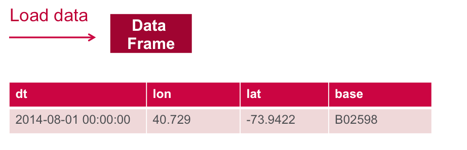

Using Spark 2.4.5 and  we create a DataFrame from a CSV file data source and apply the schema.

val df = spark.read.option("header","false").schema(schema).csv("C:/Users/vishal rana/Desktop/spark-ml-kmeans-uber-master/data/uber.csv")

Note that with Spark 2.0, specifying the schema when loading data into a DataFrame will give better performance than schema inference.

DataFrame printSchema() prints the schema to the console in a tree format, shown below after running in a intelij Console:

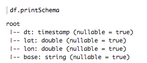

DataFrame show() displays the first 20 rows

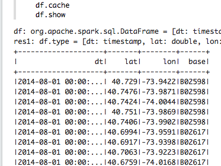

Define Features Array
In order for the features to be used by a machine learning algorithm, the features are transformed and put into Feature Vectors, which are vectors of numbers representing the value for each feature. Below, a VectorAssembler is used to transform and return a new DataFrame with all of the feature columns in a vector column.

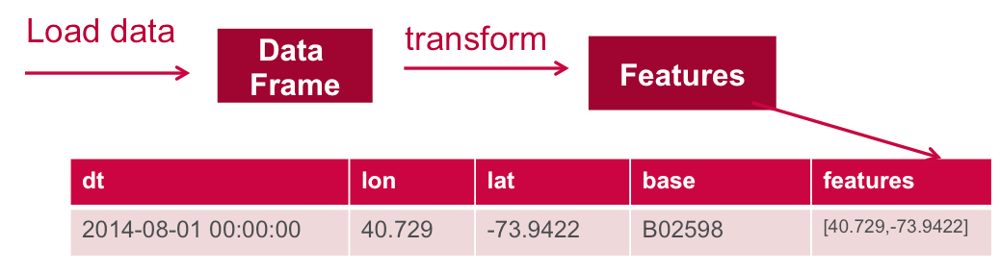

define the feature columns to put in the feature vector

val featureCols = Array("lat","lon")

set the input column names

val assembler = new VectorAssembler().setInputCols(featureCols).setOutputCol("features")

return a dataframe with all of the feature column in a vector column

val df2 = assembler.transform(df)

df2.show()

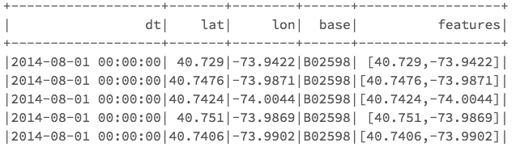

Next, we create a KMeans object, set the parameters to define the number of clusters and the maximum number of iterations to determine the clusters, and then we fit the model to the input data.

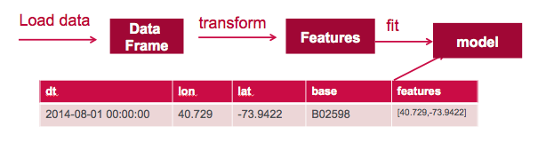

val Array(train,test) = df2.randomSplit(Array(0.7,0.3),5043)

val kmeans = new KMeans().setK(8).setFeaturesCol("features").setPredictionCol("Prediction")

val model = kmeans.fit(train)

println("Final Centers:")
model.clusterCenters.foreach(println)
output of model cluster center

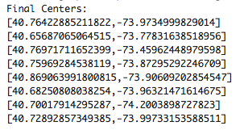

Next, we use the model to get the clusters for test data in order to further analyze the clustering.

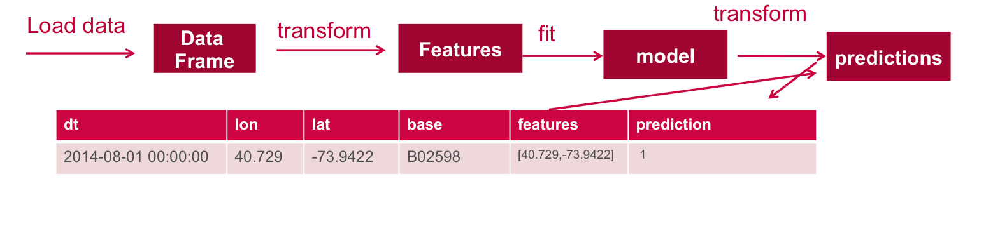

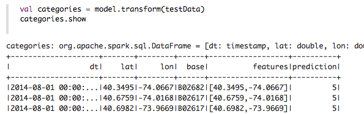

Now we can ask questions like, "Which hours of the day and which cluster had the highest number of pickups?"

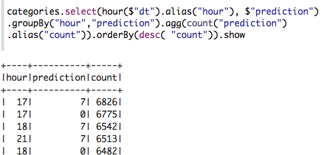

How many pickups occurred in each cluster?

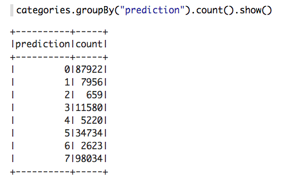

You can register a DataFrame as a temporary table using a given name, for example: df.registerTempTable("uber") , and then run SQL statements using the SQL methods provided by SparkSession.

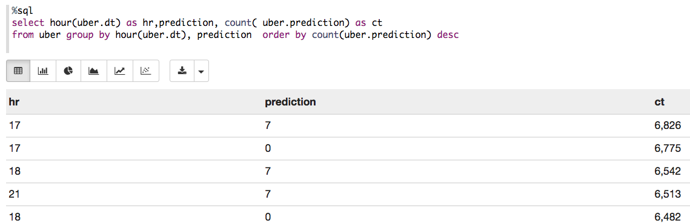
